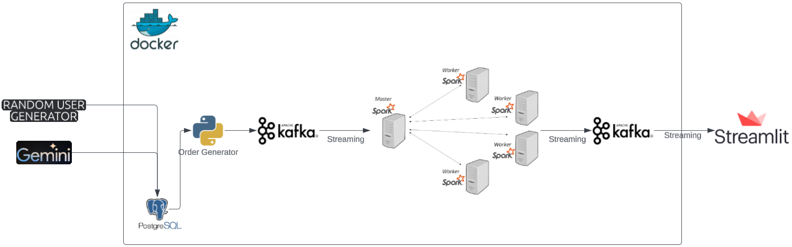
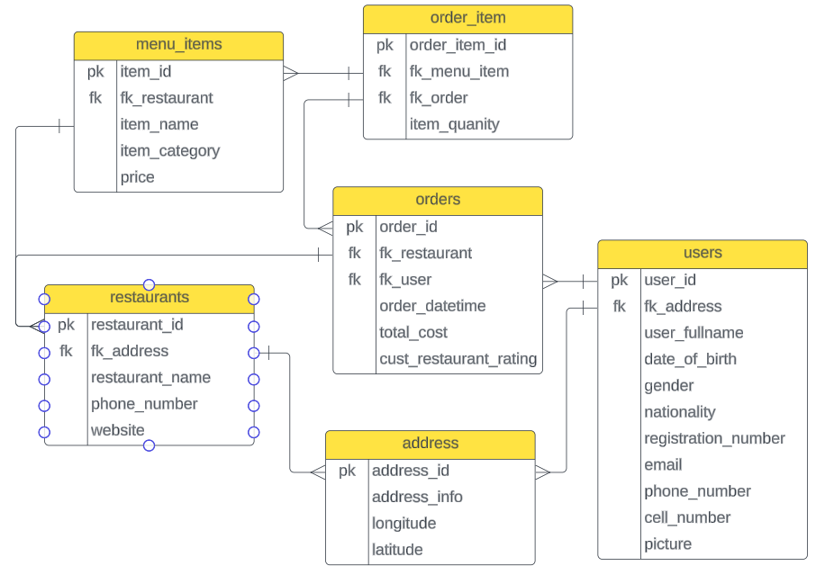
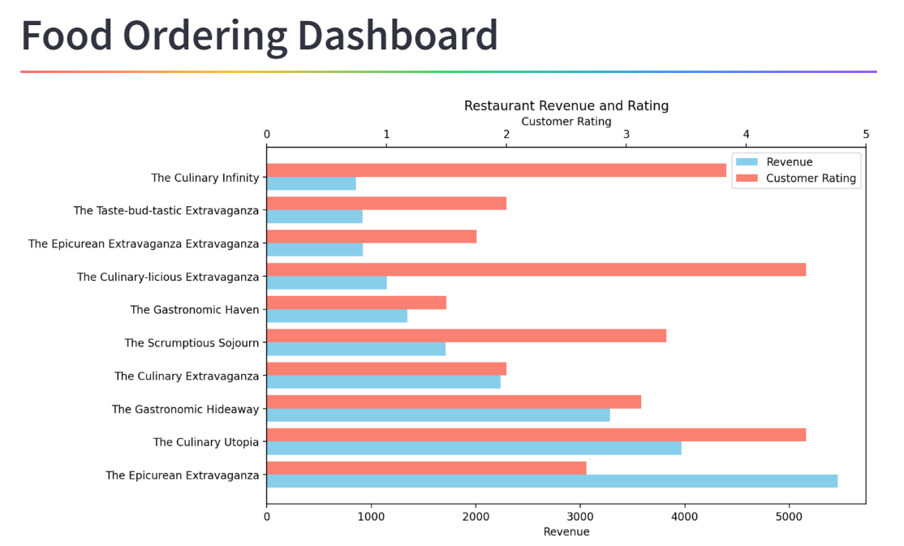
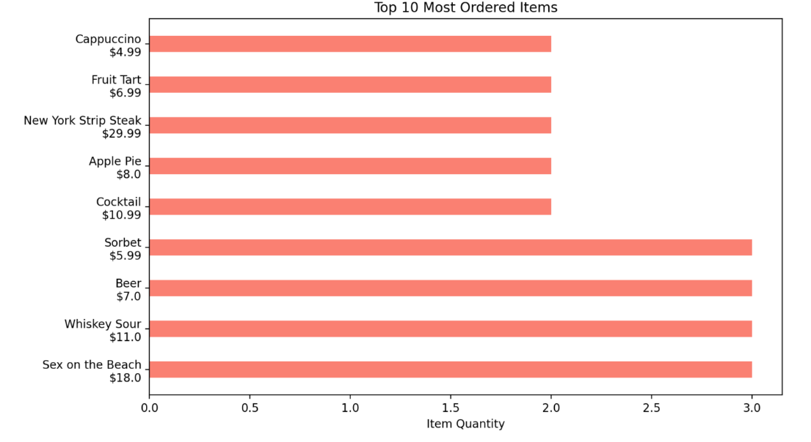
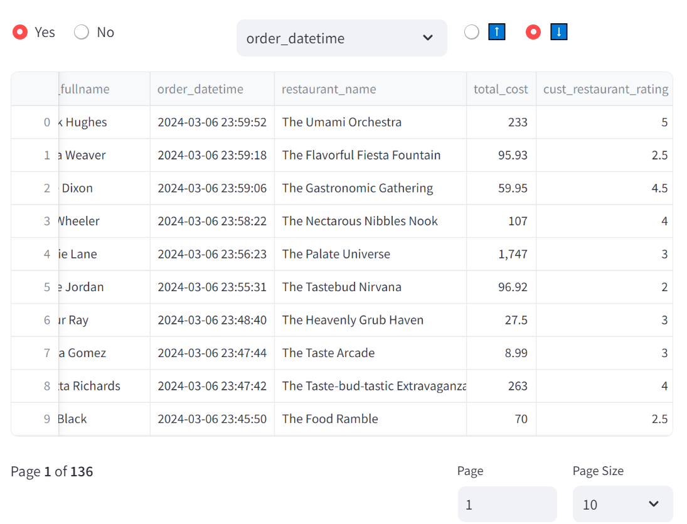

# Realtime Food Ordering System
## Description
In this project, realtime food ordering system is simulated for data engineering use case. Synthetic data is generated using [Random User API](https://randomuser.me/) to create random users, and [Google Gemini](https://deepmind.google/technologies/gemini/#introduction) is used to generate random restaurants along with the menu and prices. Realtime dashboard is created using Streamlit to give some basic insight related to orders. 
## System Architecture

- Data is generated using random api user and Google Gemini Large Language Model, and inserted into **Postgres** database.
- After that python script runs to generate random order and streams it using **Kafka**.
- **Spark** consumes that data in realtime and apply some aggregations as calculating the total revenue of each restaurant, and calculating the ordered menu item count. 
- After that **Kafka** streams that aggregated data.
- Finally **Streamlit applicaton** consumes that aggregated data and creates dashboard.
## Data Model

## Dashboard
Dashboard is created using Streamlit.



## Code Usage
First install the required python libraries.
```
pip install -r requirements.txt
```
Create **.env** file in the main directory containing the google api key as below.
```
GOOGLE_API_KEY=your-api-key
```
Run docker container in detached mode.
```
docker-compose up -d
```
Run **main.py** to generate users and restaurants, and insert them to database. In total it generates 10000 users and 500 restaurants, it may take sometime.
```
python main.py
```
When main.py finishes, run **ordering.py** by providing 2 dates in mm/dd/yyyy format. This script generates random orders and streams the data in realtime. You should run **spark-stream.py** simultaneously to consume the orders and apply aggregations.
```
python ordering.py 03/08/2024 03/09/2024
python spark-stream.py
```
Also, simultaneously run streamlit application to create realtime dashboard.
```
streamlit run dashboard.py
```
## Used Resources
- [Sample Project](https://github.com/airscholar/realtime-voting-data-engineering)